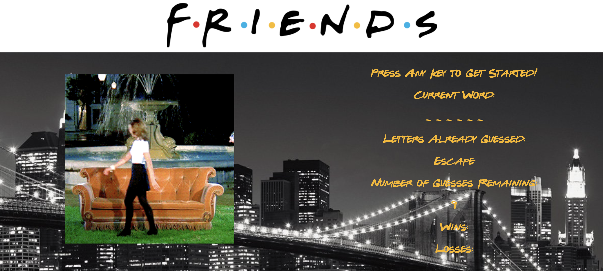

# wordGuessGame

### About my App:

This app is a simplified version of hangman made out of javascript.  It uses an on-key event listener that keeps track of the letters the player guesses on the keyboard.  The player selects any key on the keyboard to start playing.

### How My App Works:

* The player guesses letters to determine the word, based on the length of underscores displayed on the screen.
* If the player guesses letter correctly, the letter goes above one of the underscores.
* If the player does not guess correctly, the letter goes under Letters Already Guessed, and the Number of Guesses Remaining decreases by one.
* If the player guesses the word correctly, the wins increase by one point.  The screen displays a animated gif of the correct word, and the theme song plays.
* If the player does not guess the word correctly, the losses increase by one point.  The screen displays a animated gif indicating you did not get the word correct, and no theme music plays.

### Technologies Used for this App:

* Bootstrap, and
* Javascript

### Thank you for visiting my GitHub! 

Enjoy using my app here: https://lucyq19.github.io/wordGuessGame/

If you like this app, you may enjoy using more of my apps here: https://lucyq19.github.io/professionalPortfolio/
